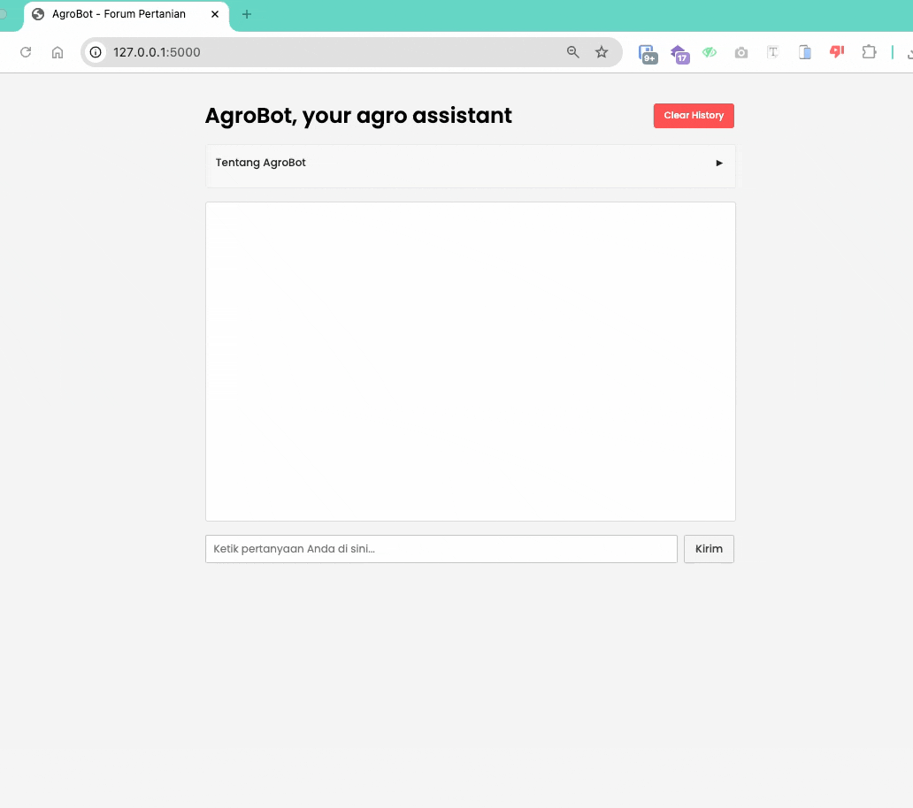

# AgroBot - Agricultural Assistant



AgroBot is an AI-powered agricultural assistant designed to help farmers, agricultural professionals, and farming enthusiasts with their agricultural-related questions.

## Features

- Real-time chat interface with an AI assistant
- Specialized in agricultural topics including:
  - Plant care and cultivation techniques
  - Pest and disease management
  - Soil management and fertilization
  - Best farming practices
  - General agricultural advice
- Persistent chat history using localStorage
- Collapsible information panel
- Responsive design

## Tech Stack

### Frontend
- HTML5
- CSS3
- JavaScript
- jQuery & jQuery UI
- Poppins font family

### Backend
- Python
- Flask
- Flask-CORS
- Groq API (Llama3-8b-8192 model)

## Setup

1. Clone the repository:
```bash
git clone https://github.com/agung037/chatbot-pertanian.git
cd chatbot-pertanian
```

2. Create a virtual environment and activate it:
```bash
python -m venv venv
source venv/bin/activate  # On Windows: venv\Scripts\activate
```

3. Install the required packages:
```bash
cd backend
pip install -r requirements.txt
```

4. Create a `.env` file in the backend directory and add your Groq API key:
```
GROQ_API_KEY=your_api_key_here
```

5. Start the Flask server:
```bash
python app.py
```

6. Open `http://127.0.0.1` in your web browser or serve it using a local server.


## API Endpoints

- `POST /chat`: Send messages to the AI assistant
  - Request body: `{ "message": "your question here" }`
  - Response: `{ "response": "AI assistant's answer" }`

## Contributing

Feel free to submit issues and enhancement requests!

## License

This project is licensed under the MIT License - see the LICENSE file for details.
